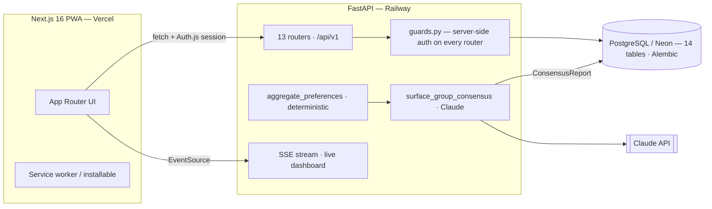

# Trivo — AI-Native Group Travel Coordination

> Group travel breaks down not on logistics, but on the conversations nobody has: budgets people won't state, diets discovered on the ground, and one organizer quietly carrying the whole trip. Trivo is the coordination layer that surfaces those silent misalignments **before** money is spent.

**Live:** [trivo-argaur.vercel.app](https://trivo-argaur.vercel.app) &nbsp;·&nbsp; **API:** [group-project-pwa-production.up.railway.app/health](https://group-project-pwa-production.up.railway.app/health)
&nbsp;·&nbsp; **PRD:** [`Reference Files/Group Travel PRD v1.md`](Reference%20Files/Group%20Travel%20PRD%20v1.md)

Stack: Next.js 16 (PWA) · FastAPI · PostgreSQL/Neon · Claude · SSE · deployed on Vercel + Railway.

---

## The problem

The group-travel market is **$168.7B and growing at 7.2% CAGR — faster than solo travel — yet the coordination layer is almost entirely unsolved.** Groups stitch together WhatsApp, Google Sheets, Splitwise, Airbnb, and Maps, and one person absorbs the entire coordination burden. From 11 user interviews, three root problems surfaced (full detail in the [PRD](Reference%20Files/Group%20Travel%20PRD%20v1.md)):

1. **Silent budget misalignment** — budget is the #1 source of friction and the least openly discussed. People proxy it through Airbnb price picks; the mismatch surfaces mid-trip as resentment. *"They'll say 'I'm okay with it' — and on the trip say 'this is getting too costly for me.'"*
2. **The organizer tax** — 1–2 people do 80%+ of research, booking, reminders, and settlement. The organizer reliably has the worst trip.
3. **No single source of truth** — decisions get buried across five apps; passive members never get a signal that something needs them.

Trivo's V1 attacks problem #1 head-on with an anonymous preference layer, then reasons over it with AI.

---

## The AI approach — deterministic where possible, LLM for reasoning

The interesting engineering decision here is **the split**, not the model call.

```
per-member preferences (anonymous)
        │
        ▼
┌───────────────────────────┐     deterministic, trustworthy, testable
│  aggregate_preferences()  │     budget overlap · spread · gap_flags
│  (pure Python, unit-tested)│    (budget_gap / no_budget_overlap) · distributions
└───────────────────────────┘
        │  aggregate (no identities, numbers already computed)
        ▼
┌───────────────────────────┐     reasoning + language only — never arithmetic
│ surface_group_consensus() │     structured output → ConsensusReport
│   Silent Conflict Surfacer│     agreement · silent_conflicts · directions
└───────────────────────────┘
        │  grounded, anonymized report (persisted, keyed by input hash)
        ▼
   preference-summary UI (the hero AI moment)
```

**The math is deterministic.** `backend/services/preference_summary.py::aggregate_preferences` computes budget overlap, spread, distributions, and the `gap_flags` (`budget_gap`, `no_budget_overlap`) with plain Python. It is fully unit-tested and never involves the model.

**The LLM only reasons and narrates.** `backend/services/ai.py::surface_group_consensus` — the **Silent Conflict Surfacer** — consumes the *computed aggregate* (never raw per-user data) and returns a typed `ConsensusReport`:

- `agreement` — what the group clearly aligns on.
- `silent_conflicts` — tensions nobody voiced (especially quiet budget splits), each with a severity and an anonymized *"who should talk"* framing.
- `directions` — 2–3 trip directions with explicit tradeoffs and a confidence signal.

Three guardrails make the AI claim defensible rather than decorative:

| Guardrail | How it's enforced |
|---|---|
| **Grounded conflicts only** — never invent tension | The prompt restricts conflicts to the deterministic `gap_flags`; **code then re-filters** every returned conflict, dropping any not grounded in a real flag (`ai.py`). Belt-and-suspenders. |
| **Anonymity is absolute** — never surface an individual | The model only ever sees anonymized aggregates; it's instructed to reason over sub-groups, never people. The eval suite asserts no attribution phrasing leaks. |
| **Reliable structured output** | `client.messages.parse(..., output_format=ConsensusReport)` — parsing can't silently fall through to `{"raw": ...}`. On failure it raises so the caller falls back to a *labeled* deterministic summary, never silent canned data. |

**It's measured, not asserted.** `backend/evals/` holds 10 labeled synthetic scenarios (clear consensus, hidden/extreme budget split, dietary conflict, too-few-responses, no-real-conflict) that assert: valid structured output, must-flag/must-not-flag rules per scenario, the grounding invariant, and the never-names-a-user invariant. Two adversarial tests feed deliberately misbehaving model output and prove the grounding guardrail strips it. Runs in CI against a deterministic stub (no key); `RUN_LIVE_EVALS=1` runs the same scenarios against the real model.

```bash
cd backend && python -m evals.run          # one command, CI-safe
RUN_LIVE_EVALS=1 python -m evals.run --live  # against Claude
```

---

## Architecture



| Layer | Technology | Hosting |
|---|---|---|
| Frontend | Next.js 16 + next-pwa | Vercel |
| Backend | FastAPI (async Python 3.13) | Railway |
| Database | PostgreSQL (14 tables, 7 Alembic migrations) | Neon serverless |
| AI | Claude (structured outputs) | Anthropic |
| Realtime | FastAPI SSE (in-memory pub/sub) | Railway |
| Auth | Auth.js (JWT session → backend guards) | — |

**Notable in the code:** consistent server-side auth guards on all 13 routers (`routers/guards.py`), a coherent 14-table schema with a clean Alembic chain, the surfacer's report **persisted** in `group_consensus_reports` keyed by a hash of the aggregate (generated once, invalidated when a new preference lands), and hardened ID parsing so malformed IDs return 4xx, not 500s.

---

## Repository layout

```
group-travel-pwa/
├── frontend/            # Next.js 16 PWA (App Router, Auth.js, Tailwind)
├── backend/             # FastAPI
│   ├── routers/         # 13 routers, all behind guards.py
│   ├── services/
│   │   ├── preference_summary.py  # deterministic aggregate (unit-tested)
│   │   ├── ai.py                  # Silent Conflict Surfacer (structured output)
│   │   ├── settlement.py          # pure debt-settlement algorithm (unit-tested)
│   │   └── invite_tokens.py       # HMAC invite-token crypto (unit-tested)
│   ├── evals/           # AI eval harness (10 labeled scenarios + guardrail tests)
│   ├── tests/           # pytest unit tests
│   └── alembic/         # migrations
├── docs/                # "How I designed the AI" writeup
└── Reference Files/     # PRD (source of truth)
```

## Testing & CI

`.github/workflows/ci.yml` runs on every push/PR to `main`:

- **Frontend** — `npm ci` → ESLint → `tsc --noEmit`.
- **Backend** — `pytest` (unit tests + AI eval suite) → the one-command eval runner.

```bash
cd backend && python -m pytest      # 47 tests: settlement, invite-token crypto,
                                    # aggregate_preferences, and the eval suite
```

## Local development

```bash
# Backend
cd backend
python -m venv venv && source venv/Scripts/activate   # Windows Git Bash
pip install -r requirements-dev.txt
cp .env.example .env                                   # set DATABASE_URL, ANTHROPIC_API_KEY, secrets
alembic upgrade head
uvicorn main:app --reload

# Frontend
cd frontend
npm install
npm run dev
```

## Screenshots

> _Placeholder — add captured screens/GIF to `docs/screenshots/` and link them here._

| Preference summary (AI hero) | Group dashboard | Settlement |
|---|---|---|
| _todo_ | _todo_ | _todo_ |

---

## What I'd build next — the AI Trip Coordinator (tool-use agent)

The Surfacer proves the discipline (deterministic core + evaluated LLM). The next phase of the AI is an **agentic Trip Coordinator**: a Claude loop with tools (Places search, budget math, availability) that answers organizer questions and drafts plans end-to-end — highest scope and risk, deliberately sequenced *after* the eval harness exists so its behavior can be measured the same way. See [`docs/`](docs/) for the full design rationale.

---

Built by [Gaurav Gupta](https://linkedin.com/in/ar-gaurav) — Senior PM & AI Strategist. Product thinking lives in the [PRD](Reference%20Files/Group%20Travel%20PRD%20v1.md); the reasoning behind the AI lives in [`docs/`](docs/).
